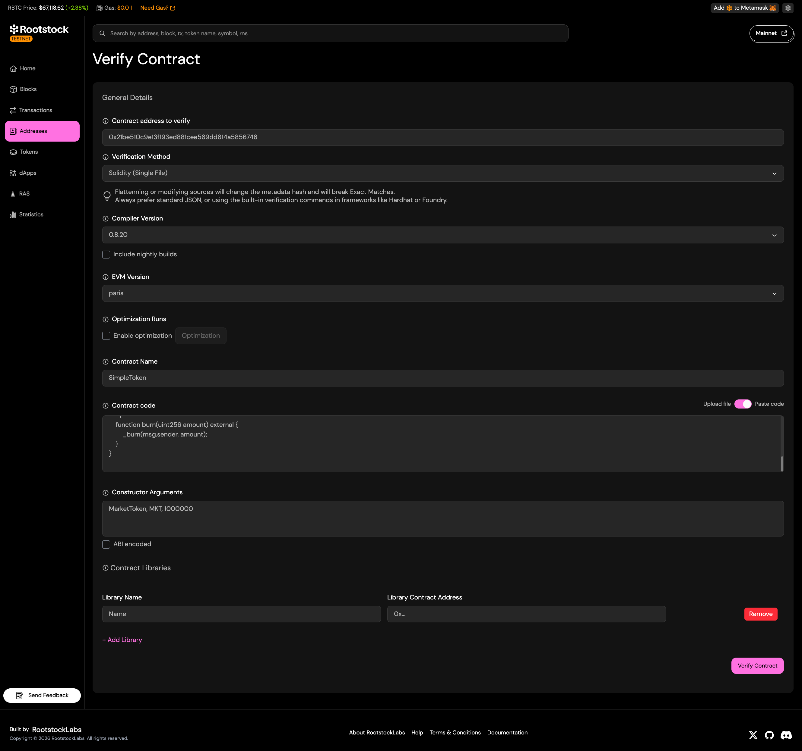
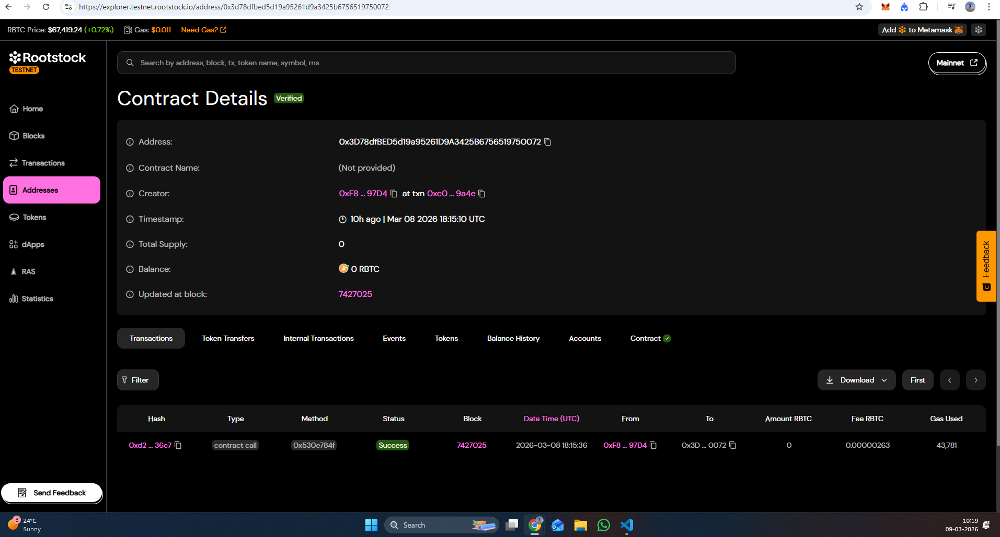

# Module 7 Assessment - Smart Contract Verification

Complete this file after deploying and verifying your contracts on RSK Testnet.

---

## (1) Verified Contract URLs

Provide the RSK Testnet Explorer URLs for each verified contract:

### SimpleToken
```text
https://explorer.testnet.rootstock.io/address/0x2074b4aaf651f8c289e6c3c8612847366318bb96
```

### PriceOracle
```text
https://explorer.testnet.rootstock.io/address/0x6fecd62f019333d9bad35d078754f454e8db9534
```

### NFTMarketplace
```text
https://explorer.testnet.rootstock.io/address/0x711ddbde630d59d5f56c1afc92abc57945ef8c33
```

---

## (2) Screenshot - Verification Form

Provide a screenshot of the RSK Testnet Explorer verification form for **one** of your contracts.
This should show the form filled out with the correct settings (compiler version, EVM version, etc.)



---

## (3) Screenshot - Verified Code Tab

Provide a screenshot of the RSK Testnet Explorer "Code" tab after successful verification for **one** of your contracts.
This should show the green checkmark and the verified source code.



---

## Notes (Optional)

Add any notes or observations from your verification process:

```text
[
  {
    "constructorArguments": [
      "0x2074b4AAF651f8c289e6c3C8612847366318Bb96"
    ]
  }
]

the arguments should be in this format and needs to be abi encoded with abi encoded checked.
```
