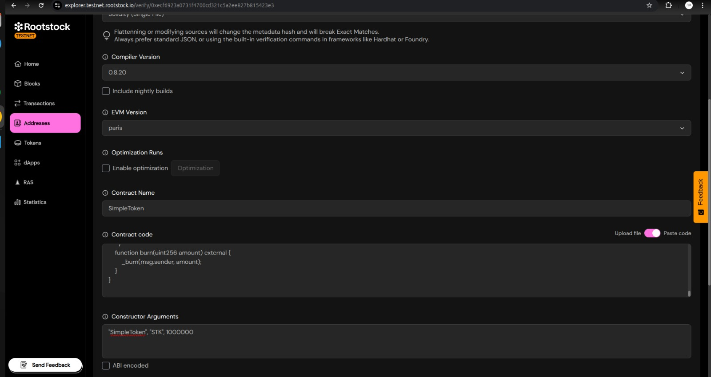
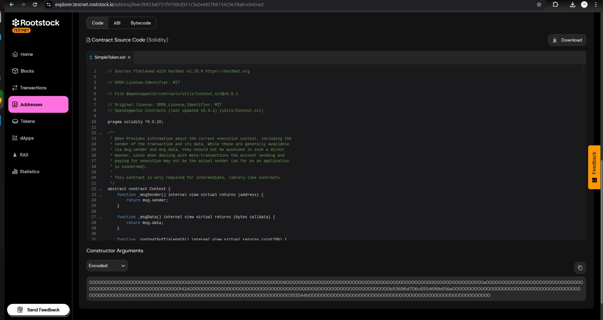

# Module 7 Assessment - Smart Contract Verification

Complete this file after deploying and verifying your contracts on RSK Testnet.

---

## (1) Verified Contract URLs

Provide the RSK Testnet Explorer URLs for each verified contract:

### SimpleToken
```text
https://explorer.testnet.rootstock.io/address/0xecf6923a0731f4700cd321c5a2ee827b815423e3?tab=contract
```

### PriceOracle
```text
https://explorer.testnet.rootstock.io/address/0xc590cdbe869ac02652565d1c8ffd878173a4160f?tab=contract
```

### NFTMarketplace
```text
https://explorer.testnet.rootstock.io/address/0xa1ffc83fee544e23b069c7e8fe29ece64938f518?tab=contract
```

---

## (2) Screenshot - Verification Form

Provide a screenshot of the RSK Testnet Explorer verification form for **one** of your contracts.
This should show the form filled out with the correct settings (compiler version, EVM version, etc.)



---

## (3) Screenshot - Verified Code Tab

Provide a screenshot of the RSK Testnet Explorer "Code" tab after successful verification for **one** of your contracts.
This should show the green checkmark and the verified source code.



---

## Notes (Optional)

Add any notes or observations from your verification process:

```text
The PriceOracle and NFTMarketplace contracts were already verified on the explorer
before I submitted. same addresses as the course examples. I deployed a fresh
SimpleToken to practice the full verification flow end-to-end.
```
