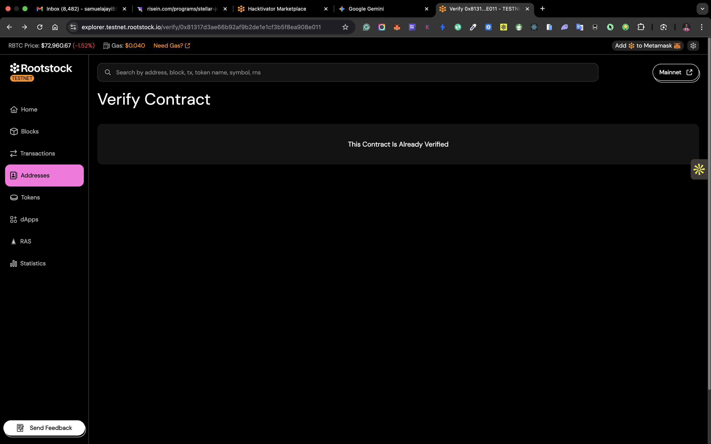
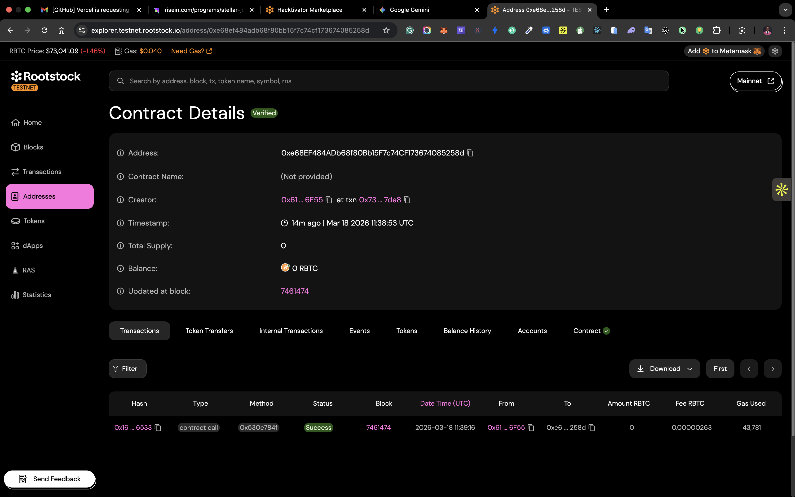

# Module 7 Assessment - Smart Contract Verification

Complete this file after deploying and verifying your contracts on RSK Testnet.

---

## (1) Verified Contract URLs

Provide the RSK Testnet Explorer URLs for each verified contract:

### SimpleToken
```text
https://explorer.testnet.rootstock.io/token/0x77eee9db3aba893862b4fc377b142f3d9e6c025b
```

### PriceOracle
```text
https://explorer.testnet.rootstock.io/address/0x81317d3ae66b92af9b2de1e1cf3b5f8ea908e011
```

### NFTMarketplace
```text
https://explorer.testnet.rootstock.io/address/0xe68ef484adb68f80bb15f7c74cf173674085258d
```

---

## (2) Screenshot - Verification Form

Provide a screenshot of the RSK Testnet Explorer verification form for **one** of your contracts.
This should show the form filled out with the correct settings (compiler version, EVM version, etc.)



---

## (3) Screenshot - Verified Code Tab

Provide a screenshot of the RSK Testnet Explorer "Code" tab after successful verification for **one** of your contracts.
This should show the green checkmark and the verified source code.



---

## Notes (Optional)

Add any notes or observations from your verification process:

```text
I didn't know I was to upload the form while filling
```
