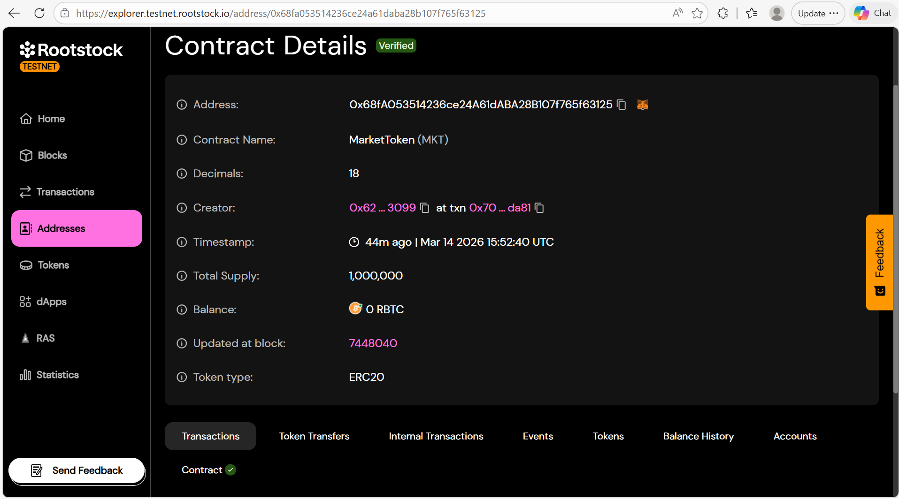

# Module 7 Assessment - Smart Contract Verification

Complete this file after deploying and verifying your contracts on RSK Testnet.

---

## (1) Verified Contract URLs

Provide the RSK Testnet Explorer URLs for each verified contract:

### SimpleToken
```text
(https://explorer.testnet.rootstock.io/address/0x68fa053514236ce24a61daba28b107f765f63125?tab=contract
)
```

### PriceOracle
```text
(https://explorer.testnet.rootstock.io/address/0x58bd36fbb8816b140d7381494204384e7eaaee92?tab=contract
)
```

### NFTMarketplace
```text
(https://explorer.testnet.rootstock.io/address/0x1c1c2712e738b0e2833594a0e30d8e5fc8023ef8?tab=contract)
```

---

## (2) Screenshot - Verification Form

Provide a screenshot of the RSK Testnet Explorer verification form for **one** of your contracts.
This should show the form filled out with the correct settings (compiler version, EVM version, etc.)



---

## (3) Screenshot - Verified Code Tab

Provide a screenshot of the RSK Testnet Explorer "Code" tab after successful verification for **one** of your contracts.
This should show the green checkmark and the verified source code.


---

## Notes (Optional)

Add any notes or observations from your verification process:

```text
YOUR_NOTES_HERE
```
