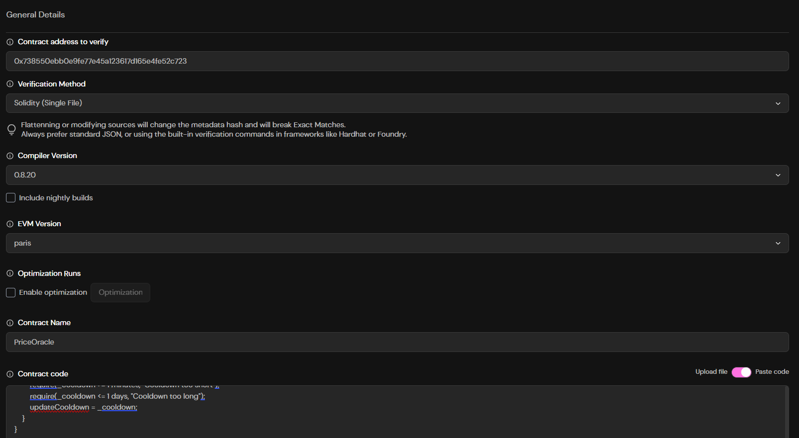
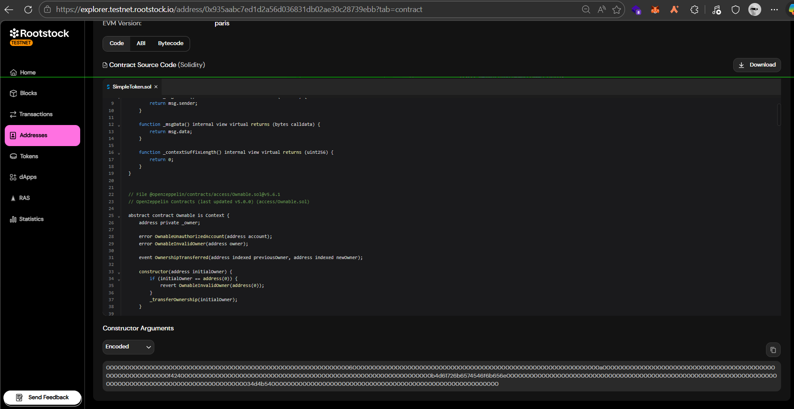

# Module 7 Assessment - Smart Contract Verification

Complete this file after deploying and verifying your contracts on RSK Testnet.

---

## (1) Verified Contract URLs

Provide the RSK Testnet Explorer URLs for each verified contract:

### SimpleToken

```text
YOUR_EXPLORER_URL_HERE=https://explorer.testnet.rootstock.io/address/0x935aabc7ed1d2a56d036831db02ae30c28739ebb?tab=contract
```

### PriceOracle

```text
YOUR_EXPLORER_URL_HERE=https://explorer.testnet.rootstock.io/address/0x738550ebb0e9fe77e45a123617d165e4fe52c723?tab=contract
```

### NFTMarketplace

```text
YOUR_EXPLORER_URL_HERE=https://explorer.testnet.rootstock.io/address/0x0a2d089908c58085fcca307672bc25922df184f7
```

---

## (2) Screenshot - Verification Form

Provide a screenshot of the RSK Testnet Explorer verification form for **one** of your contracts.
This should show the form filled out with the correct settings (compiler version, EVM version, etc.)



---

## (3) Screenshot - Verified Code Tab

Provide a screenshot of the RSK Testnet Explorer "Code" tab after successful verification for **one** of your contracts.
This should show the green checkmark and the verified source code.


---

## Notes (Optional)

Add any notes or observations from your verification process:

```text
When Hardhat flattened the`SimpleToken.sol` it pulled in all the files it depends on: `Context.sol`, `Ownable.sol`, `IERC6093.sol`, `IERC20.sol`, `IERC20Metadata.sol` and `ERC20.sol`. Each of those files originally had their own `pragma solidity` line at the top.

So in the flattened file it ended up with `pragma solidity ^0.8.20` appearing at the top of the `Context.sol` section, then again at the top of the `Ownable.sol` section, then again at the `ERC20.sol` section, and then again before the `SimpleToken` contract. That is 4 copies of the same line inside one file.

`IERC20Metadata.sol` also added its own `pragma solidity >=0.6.2` and `IERC20.sol` added `pragma solidity >=0.4.16`.

The verifier sees all of those pragma lines and does not know which one to follow so it just fails. I deleted all of them except the very first one at the top of the file, which covers the entire combined file. Everything still compiles correctly because that one pragma applies to all the code below it.
```
