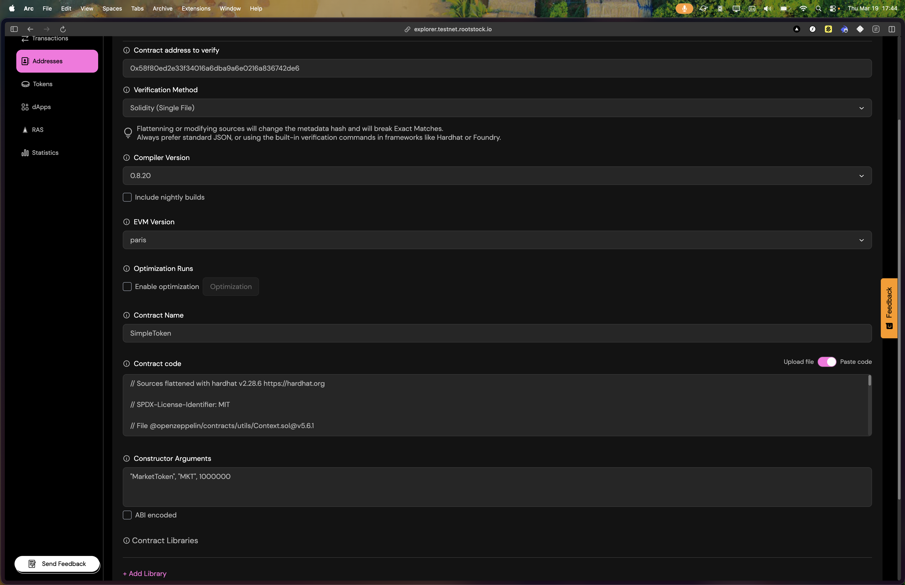

# Module 7 Assessment - Smart Contract Verification

Complete this file after deploying and verifying your contracts on RSK Testnet.

---

## (1) Verified Contract URLs

Provide the RSK Testnet Explorer URLs for each verified contract:

### SimpleToken
```text
https://explorer.testnet.rootstock.io/address/0x58F80eD2e33F34016A6dBa9a6e0216a836742de6?tab=contract
```

### PriceOracle
```text
https://explorer.testnet.rootstock.io/address/0x1B7fEEa6356568d882962975Bd4A0c85148975af?tab=contract
```

### NFTMarketplace
```text
https://explorer.testnet.rootstock.io/address/0x7a00E11065071c292AC9D83e91014C6ac00f4e19?tab=contract
```

---

## (2) Screenshot - Verification Form

Provide a screenshot of the RSK Testnet Explorer verification form for **one** of your contracts.
This should show the form filled out with the correct settings (compiler version, EVM version, etc.)



---

## (3) Screenshot - Verified Code Tab

Provide a screenshot of the RSK Testnet Explorer "Code" tab after successful verification for **one** of your contracts.
This should show the green checkmark and the verified source code.


---

## Notes (Optional)

Add any notes or observations from your verification process:

```text
YOUR_NOTES_HERE
```
